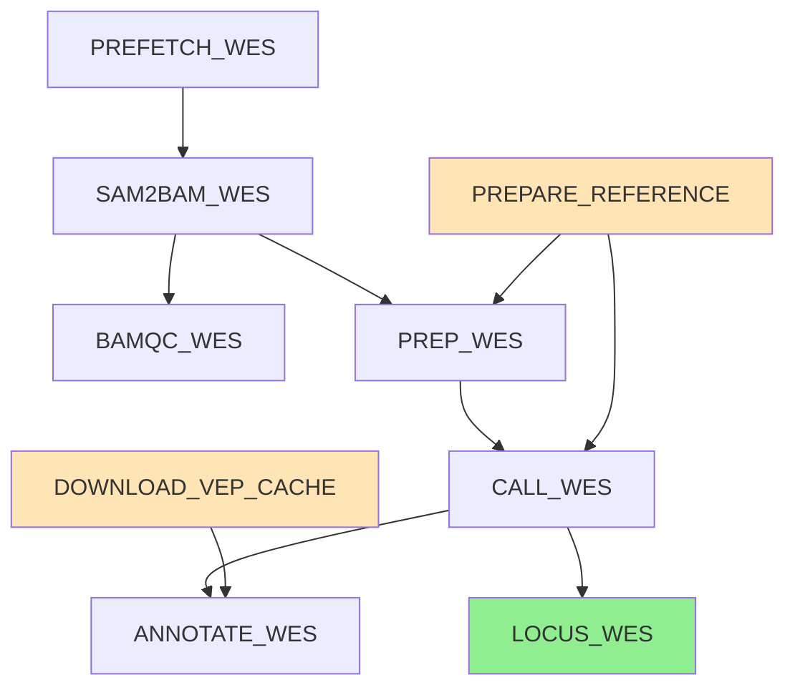

# nf-loxhd1

A Nextflow + Docker pipeline that reproduces the publicly executable part of Hytönen et al. 2021,
*Missense variant in LOXHD1 is associated with canine nonsyndromic hearing loss*
(Human Genetics 140:1611–1618, [doi:10.1007/s00439-021-02286-z](https://doi.org/10.1007/s00439-021-02286-z)).

Starting from raw SRA data for one affected Rottweiler, the pipeline runs
an end-to-end variant calling workflow on canFam3.1 and outputs the genotype at the LOXHD1
candidate locus plus a annotated VCF.

## Key result
|  |  |
| Sample | SRR13743383 (BioSample `SAMN17983069`, affected Rottweiler, WES) |
| Position | chr7:44,806,821 |
| Variant | G > C |
| Genotype | 1/1 (homozygous ALT, C/C) |
| Depth | DP=32, AD=0,28 (0 REF, 28 ALT reads) |
| Quality | QUAL=895, GQ=84, MQ=60 |
| VEP annotation | LOXHD1 missense, p.(Gly1914Ala), c.5747G>C |

Full output: `results/locus/SRR13743383_WES_locus.txt`.
Detailed results: [RESULTS.md](RESULTS.md).

## Pipeline structure



| Process | Purpose | Tool |
|---|---|---|
| `PREPARE_REFERENCE` | Rename NCBI contigs (NC_*) to chr-style; index | samtools 1.19 |
| `PREFETCH_WES` | Pull aligned BAM from SRA via prefetch | sra-tools 3.1.1 |
| `SAM2BAM_WES` | Convert sam output to BAM | samtools 1.19 |
| `BAMQC_WES` | Mapping/coverage QC | samtools 1.19 |
| `PREP_WES` | Coordinate-sort, mark duplicates | GATK 4.5.0 |
| `CALL_WES` | HaplotypeCaller,  GenotypeGVCFs | GATK 4.5.0 |
| `DOWNLOAD_VEP_CACHE` | Fetch Ensembl release-104 cache (CanFam3.1) | ubuntu + wget |
| `ANNOTATE_WES` | Functional annotation | Ensembl VEP 104 |
| `LOCUS_WES` | Extract genotype at candidate position | bcftools 1.19 |

The WGS branch is wired in `main.nf` but commented out (don't have enough computational resources)
moreover the WES branch alone reproduces the key result.

## Reference download

```bash
mkdir -p assets && cd assets
datasets download genome accession GCF_000002285.3 --include genome
unzip ncbi_dataset.zip
mv ncbi_dataset/data/GCF_000002285.3/*.fna canFam3.1.fa
```

## Run

```bash
nextflow run main.nf -profile docker \
    --wes_srr SRR13743383 \
    --ref_fasta assets/canFam3.1.fa \
    --locus chr7:44806821-44806821
```

Use `-resume` to skip cached steps on rerun.

## Output layout

The repository includes only qc, locus and pipeline_info due to file size limits

```
results/
  reference/ - canFam3.1 with renamed contigs, plus .fai and .dict
  bam/ - prepared BAMs 
  qc/ - flagstat, idxstats, contig-name dump
  vcf/ - raw VCF and VEP-annotated VCF
  locus/ - genotype at the target position  (key result)
  pipeline_info/ - Nextflow execution report, timeline, DAG
```

## Repository layout

```
nf-loxhd1/
  main.nf - orchestrator
  nextflow.config - executor and container config
  modules/ - per-tool Nextflow processes
  results/- pipeline outputs 
  README.md - this file
  RESULTS.md - full results breakdown with numbers
```

## Reference

Hytönen MK et al. *Missense variant in LOXHD1 is associated with canine nonsyndromic hearing
loss.* Hum Genet 140:1611–1618 (2021).
[doi:10.1007/s00439-021-02286-z](https://doi.org/10.1007/s00439-021-02286-z)
